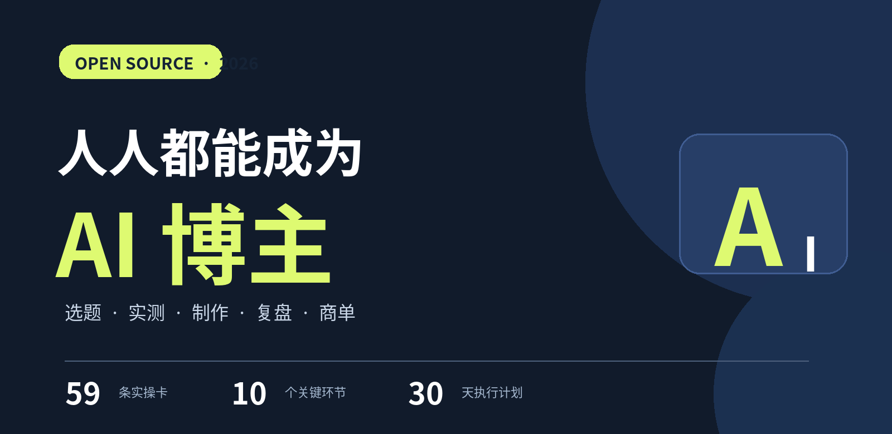

<div align="center">



# 人人都能成为 AI 博主

**从零起号、低粉爆款研究、产品实测、内容制作，到复盘和商单的开源实操手册。**

**59 条操作卡 · 10 个章节 · 30 天网页打卡 · 完整跟拍案例 · 离线检索与进度备份 · AI Skill**

[](LICENSE-CONTENT.md)
[](LICENSE)
[](https://aipmandy.github.io/HowToBeAnAICreator/)
[](https://github.com/AIPMAndy)

**[开始第一条作品](#5-步完成第一条-ai-视频) · [在线互动手册](https://aipmandy.github.io/HowToBeAnAICreator/) · [离线单文件（打开文件页后点 Raw 下载）](docs/offline.html) · [完整案例](examples/ai-resume-walkthrough.md) · [复制模板](templates/) · [AI Skill](skills/ai-creator-guide/SKILL.md) · [Andy 官网](https://metaver.vip/)**

</div>

---

## 这是什么项目？

我花一个月时间实践 AI 内容，逐渐获得了商单合作机会，也积累了全网 5 万多粉丝（为作者自述，未将其当作他人可复制的收益承诺）。不少人问我：**“普通人没有技术背景，从今天开始，具体先干什么？”**

这份项目不卖焦虑、不讲空话、不保证粉丝数。它只解决一个问题：**一个完全不会做自媒体的人，如何从一条自己真正做过的 AI 实测开始，建立内容生产和商业合作的完整流程。**

参考 [HowToLiveBetter](https://github.com/eternity4719/HowToLiveBetter) 的开源手册组织思路：按章节拆分，可检索、可离线、每条说明成本和证据边界；具体内容、示例、代码与视觉设计均为本项目原创。

### 三句话记住这个方法

> **先找到真实问题，再选择 AI 产品。先亲自实测，再做内容。先看数据和用户反馈，再讨论变现。**

适合：零基础自媒体新手、AI 工具爱好者、教师、HR、设计师、普通职场人，以及准备从 AI+行业出发打造个人 IP 的人。

不适合：希望 7 天保证涨粉、把别人的内容直接搬运、伪造产品效果或寻求刷量捷径的人。

## 5 步完成第一条 AI 视频

这一套不要求露脸。你只需要一个能访问的合规对话式 AI 工具和一个录屏软件。

1. **选题（10 分钟）**：以“AI 能不能帮忙整理简历”为主题；先找两条公开作品，确认有人关心。
2. **实测（20 分钟）**：用[虚构简历练习材料](examples/ai-resume-walkthrough.md)，输入[严禁编造经历的 Prompt](templates/prompts.md)；保存原文、Prompt、输出。
3. **录屏（15 分钟）**：依次展示原文、操作、输出、局限；只录自己实际做过的步骤。
4. **编辑与发布（20–40 分钟）**：按[分镜脚本](examples/ai-resume-walkthrough.md)剪掉无效等待，放大输入框，用大字字幕解释动作；合法使用音乐并处理生成合成内容标识。
5. **复盘（7 天内持续）**：在[数据表模板](templates/metrics.csv)记录发布后 24h、72h、7d 的可见数据，提出下一条要验证的一个假设。

**这一阶段的交付物：1 条原创作品链接 + 3 张截图 + 1 行数据记录。** 完成这个，就可以开始迭代。

## 按问题查目录

| 遇到的问题 | 去哪看 | 这一节的产出 |
| --- | --- | --- |
| 不知道账号讲什么 | [01 定位](book/01-定位.md) | 一句目标用户定位 |
| 不知道做哪条内容 | [02 选题](book/02-选题.md) | 有证据的选题库 |
| AI 资讯真伪难辨 | [03 核实](book/03-核实.md) | 官方依据 + 实测结果 |
| 看到工具不会写视频 | [04 脚本](book/04-脚本.md) | 分镜脚本 |
| 不露脸不会录视频 | [05 视频](book/05-视频.md) | 可发布的录屏视频 |
| 想做图文 / 公众号 | [06 图文](book/06-图文.md) | 分步骤的原创图文 |
| 不知道平台怎么发 | [07 发布](book/07-发布.md) | 合规发布记录 |
| 播放差不知道怎么改 | [08 复盘](book/08-复盘.md) | 下一轮测试假设 |
| 想接商单没有经验 | [09 变现](book/09-变现.md) | 媒体资料 + 合作台账 |
| 做了几天就断更 | [10 系统化](book/10-系统化.md) | 30 天可执行计划 |

## 每张操作卡都回答什么？

```text
[02-03] 验证低粉爆款
时间：约25分钟              依据：实践建议

步骤：
1. 比较同一账号近10条同类作品的可见表现
2. 再找两个独立账号交叉验证
3. 从评论中寻找真实的“求教程”“怎么用”提问

验收物：候选题的 3 个独立证据及未知项
避坑：单条爆款可能是热点、投放或随机波动
```

所有操作卡都通过 [`data/cards.json`](data/cards.json) 统一维护，避免网页与 Markdown 内容不同步。针对常见的关键步骤，我们额外给出实际填写示例和“卡住时”的处理方法；网站还有 **30 天打卡、进度导入/导出、离线完整案例**。

## 完整资源

| 想做什么 | 入口 |
| --- | --- |
| 按关键词、优先级和章节搜索所有操作卡，并勾选或导出进度 | [在线互动手册](https://aipmandy.github.io/HowToBeAnAICreator/) · [网页版源码](docs/index.html) |
| 断网也能搜索、勾选进度，30 天打卡可导出/导入 | [离线版 HTML](docs/offline.html)，下载后直接双击 |
| 完整跟拍“AI 改简历”第一条视频 | [跟拍案例](examples/ai-resume-walkthrough.md) |
| 30 天每天做什么 | [30 天执行清单](templates/30-day-plan.csv) |
| 直接复制提示词 | [Prompt 工具包](templates/prompts.md) |
| 选题评分与研究 | [选题 CSV](templates/topic-library.csv) · [选题评分卡](templates/topic-scorecard.md) |
| 视频与账号数据复盘 | [数据表](templates/metrics.csv) · [复盘模板](templates/weekly-review.md) |
| 商单询价、媒体介绍、交付 | [合作模板](templates/brand-deal.md) · [合作台账](templates/deals.csv) |
| 让 Codex / Claude Code 按手册协作 | [AI Creator Guide Skill](skills/ai-creator-guide/SKILL.md) |
| 验证事实与平台规则 | [引用与免责声明](SOURCES.md) |

## 规则与判断边界

**官方规定**应以监管部门原文为准。例如，网信办的生成合成内容标识办法要求相关情形下发布生成合成内容时主动声明并使用服务提供者提供的标识功能；互联网广告管理办法要求商业广告具备可识别性。具体平台界面、入口与资格以发布时的规则为准。

**实践建议**包括“低粉爆款筛选”“5 秒开头”“100 分选题评分”，它们是帮助节约试错时间的工作方法，不是任何平台公布的流量公式。**原创实测**指你实际保存了输入、操作和输出，不是复述别人的演示。

**个人经历**中的合作次数、粉丝数，是作者自述的个人样本；商单邀约、确认订单、交付与回款各自不同，不能直接推导收入。

## 本地打开与部署

仓库无需安装前端框架、无需付费 API、无需后端数据库。

```bash
git clone https://github.com/AIPMAndy/HowToBeAnAICreator.git
cd HowToBeAnAICreator
python3 -m http.server 8000 --directory docs
# 打开 http://localhost:8000
```

直接双击 `docs/offline.html` 也能用完整搜索与勾选功能，不需要服务器；如浏览器禁止本地存储，页面会提醒导出备份。离线文件可独立打开，不依赖网页的 JSON/CSS/JS；外部原始来源链接则仍需联网访问。进度保存在当前浏览器本地，不上传。网站新增进度 JSON 导出/导入，方便在不同设备之间手动备份与恢复；隐私浏览模式可能不持久保存。

维护者改 `data/cards.json` 后运行：

```bash
python3 tools/build.py
python3 -m unittest discover -s tests -v
```

GitHub Pages 已启用：[在线互动手册](https://aipmandy.github.io/HowToBeAnAICreator/)。站点从 `main` 分支的 `/docs` 目录部署，后续推送会自动更新。详见 [部署说明](DEPLOY.md)。

## 质量审查与可验证性

项目附有 [对抗式审查报告](AUDIT.md)：包含发现的问题、修复状态、仍需人工核实的事项。网站数据、Markdown 章节和离线版本统一由 `python3 tools/build.py` 生成，仓库提供静态一致性测试及可选的浏览器交互检查。

## 如何参与

欢迎提交新的真实实测、勘误、官方规则更新、模板改进。每项贡献最好包含：问题、可复现步骤、示例输入、实际输出或准确出处、适用边界。不要上传用户简历、聊天记录、合同、客户姓名等隐私资料。详见 [贡献指南](CONTRIBUTING.md)。

如果这份攻略帮你发出了自己的第一条内容，欢迎 Star ⭐，也欢迎用 Issue 分享你最卡的一步。我们会优先改善有真实反馈的步骤。

## 咨询与联系（按需选择）

手册持续免费开放。如果你想聊聊 AI 创作、个人 IP 定位、AI 应用与副业起步，或求职与职业转型，可以联系作者 **AI 酋长 Andy**。

- 微信：**AIPMAndy**，添加时备注想聊的问题，简单说说目前的情况。
- 官网：[metaver.vip](https://metaver.vip/)，先了解作者与咨询方向。

咨询按需选择，服务范围与费用先沟通确认；不承诺涨粉、收入或求职结果。

## 开源协议与作者

- 文字、教学卡、图示：**CC BY 4.0**（详见 [LICENSE-CONTENT.md](LICENSE-CONTENT.md)）
- 程序与构建脚本：**MIT**（详见 [LICENSE](LICENSE)）
- 作者：**[AI 酋长 Andy](https://github.com/AIPMAndy)**

愿你的王国自由且富足。
